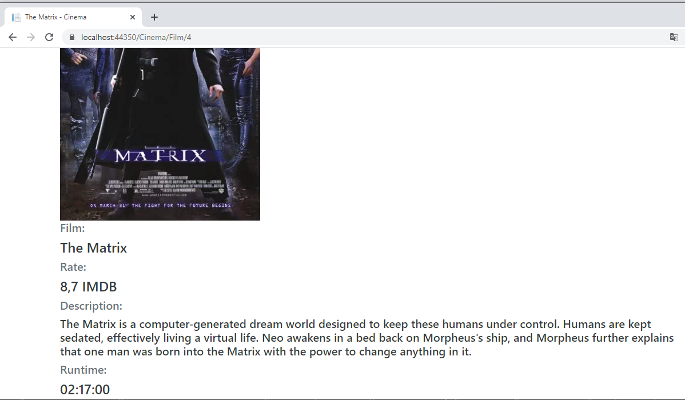

# Cinema

<h3>In the "Films" tab, you will find a list of films presented in the cinema. 
 
 
Then if you click on the title of the movie you will go to its full description 
 
After the description of the film, there are sessions ordered by date in which you can see the film. 
 
In the "Your tickets" tab, there are tickets that you have already bought. 
If you don`t logged in, you go to the page where you can enter your login and password. 
 
Or register new account. 
 
There is "Your tickets" tab: 
 
 
In the "Profile" tab, you can see your name, phone number and email(confirmed information is marked with a green checkmark). 
 
</h3>
